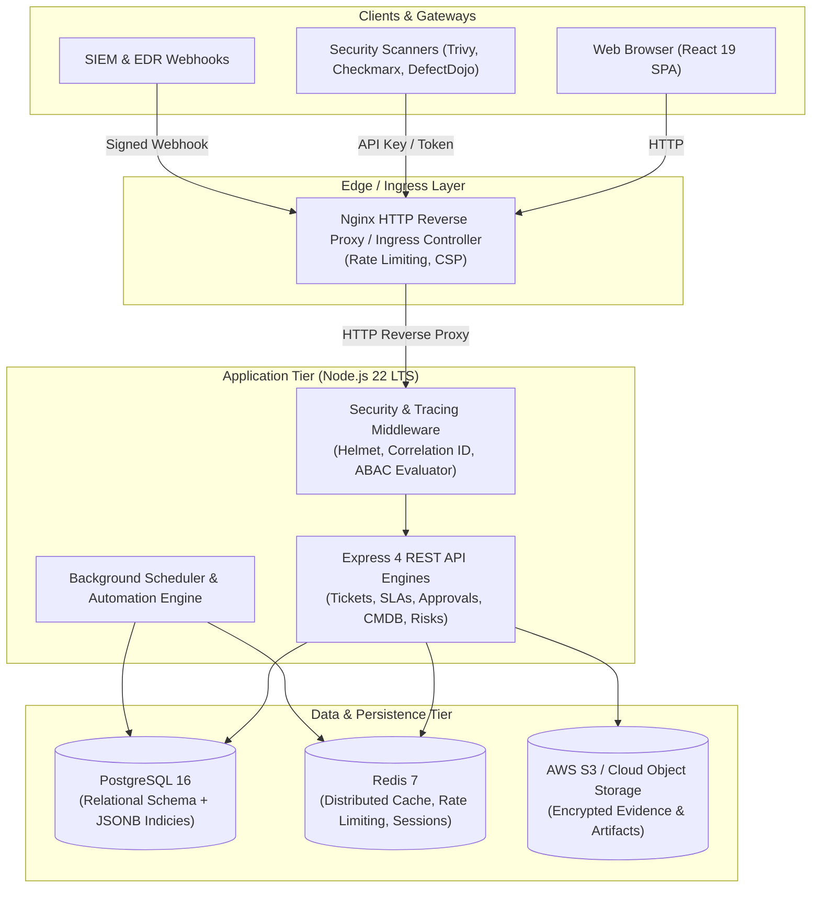

# Fiuuu Architecture Blueprint

## 1. System Overview
The Fiuuuu is an enterprise-grade SecOps and Governance, Risk, and Compliance (GRC) platform engineered for regulated financial institutions (Tier-1 Banks). It provides unified ticketing, vulnerability remediation workflows, security incident management, cryptographic multi-stage approvals, automated scanner ingestion/deduplication, Active Directory/LDAP integration, and strict Attribute-Based Access Control (ABAC).

---

## 2. Core Architectural Pillars

The canonical enterprise ticket lifecycle, invariants, and API extensions are documented in [TICKET_MANAGEMENT.md](./TICKET_MANAGEMENT.md).

### 2.1 Dual-Engine Database Architecture
- **PostgreSQL 16 (Primary Production Engine)**: Complete relational DDL schema with foreign key constraints, transactional integrity, and GIN indices on JSONB payloads (for custom fields, scanner findings, MITRE ATT&CK techniques, and exception details).
- **In-Memory Adapter (Development & Testing Engine)**: Zero-dependency in-memory execution for rapid developer workflow and sub-second CI unit test execution.

### 2.2 Cloud Object Storage Architecture (No MinIO)
- **AWS S3 / Cloud S3-Compatible Storage Provider**: Uses `@aws-sdk/client-s3` and `@aws-sdk/s3-request-presigner` for direct, encrypted upload and download of forensic PCAP files, scan reports, and audit workpapers.
- **Security Validation Pipeline**:
  - MIME type allowlisting (`application/pdf`, `image/png`, `application/vnd.tcpdump.pcap`, etc.).
  - File size bounds (25MB limit).
  - SHA-256 integrity hash verification and tamper-evident storage logging.
- **Local Secure Disk Provider**: Pluggable secure filesystem storage with directory isolation for local air-gapped staging.

### 2.3 Caching & Rate Limiting (Redis 7)
- **Distributed Cache**: Low-latency caching for CISO/Lead dashboard metrics, ticket search indexes, and SLA counters.
- **Distributed Rate Limiting**: Powered by `rate-limit-redis`, providing anti-brute-force protection on Active Directory `/api/auth/ldap-login` endpoints (15 req/15min) and API DDoS shielding (1000 req/15min).

### 2.4 Hybrid RBAC + ABAC Security Model
Every request is evaluated through an enterprise policy engine assessing:
1. **User Role & Clearance Tier** (`PUBLIC` < `INTERNAL` < `RESTRICTED` < `CONFIDENTIAL_SECURITY_ONLY` < `HIGHLY_RESTRICTED_HR_LEGAL`).
2. **Resource Domain & Category** (e.g. DLP, SOC, AppSec, GRC).
3. **Application & Asset Ownership** (verified against CMDB ownership).
4. **Explicit Restricted Whitelists** (per-ticket investigator whitelists).

### 2.5 Observability & RFC 7807 Error Handling
- **Structured JSON Logging**: `pino` logger with automatic credential redaction.
- **Correlation ID Propagation**: `x-request-id` assigned to each request and tied to audit events.
- **Kubernetes Probes**:
  - `/api/health`: Liveness probe.
  - `/api/health/ready`: Deep readiness probe verifying PostgreSQL, Redis, and Object Storage connections.
  - `/api/metrics`: Prometheus-compatible metrics endpoint.
